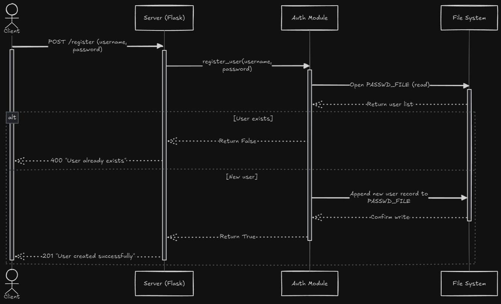
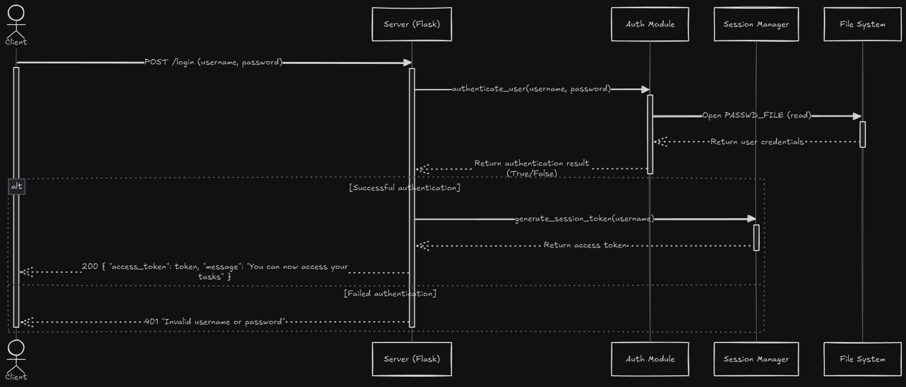
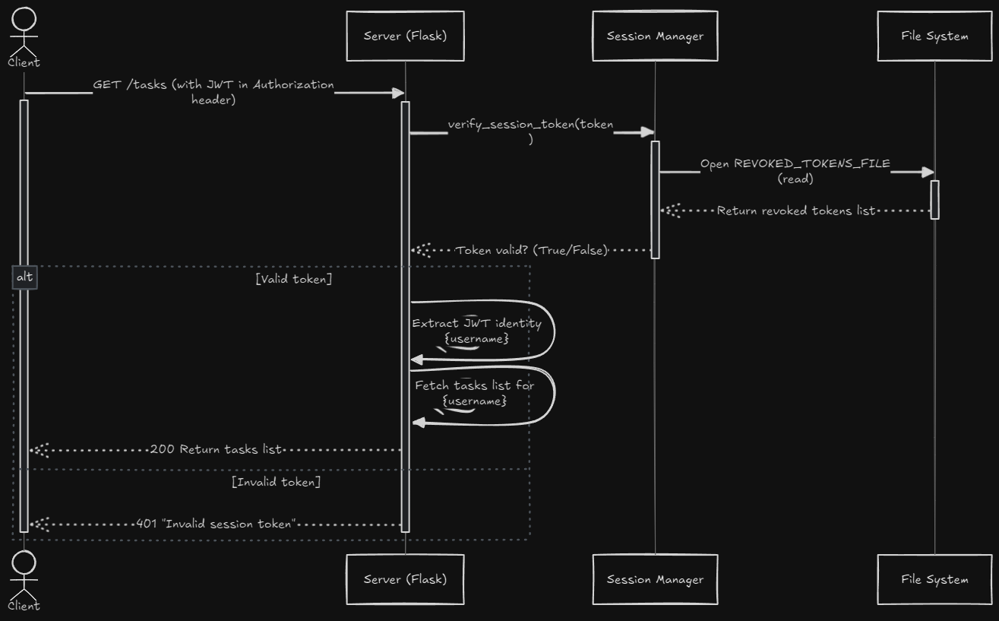
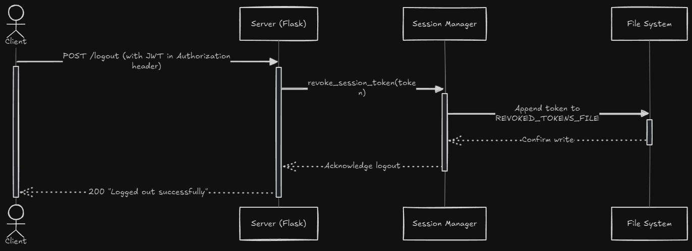

# Communication Contract
- For which teammate did you implement “Microservice A”?
  - Kaye
- What is the current status of the microservice? Hopefully, it’s done!
  - It is done, however it will need to be modified to handle tasks or to call the service that does.
- How is your teammate going to access your microservice? Should they get your code from GitHub (if so, provide a link to your public or private repo)? Should they run your code locally? Is your microservice hosted somewhere? Etc.
  - I do have the code on GitHub and they could run the microservice locally or we can work out hosting it remotely. Whatever she decides is best.
- If your teammate cannot access/call YOUR microservice, what should they do? Can you be available to help them? What’s your availability?
  - I try to check my messages daily but even if I don't notifications should let me know either way. I work M-Th, from 15:30 to 00:30 CST. Any other time I should be home.
- If your teammate cannot access/call your microservice, by when do they need to tell you?
  - Ideally as soon as possible so we can get things worked out.
- Is there anything else your teammate needs to know? Anything you’re worried about? Any assumptions you’re making? Any other mitigations / backup plans you want to mention or want to discuss with your teammate?
  - Since the primary focus of this microservice is handling user authentication and session management I have just inserted an example call for getting tasks. I am assuming that this will be implemented by another microservice and later tied into my microservice.

# How to REQUEST data
To interact with the API, you'll be sending HTTP requests to the available endpoints. Here is a quick guide for making requests:
- Registration:\
  Send a **POST** request to `/register` with a JSON payload containing the `username` and `password`.\
  Here is an example using curl:
  ```bash
  curl -X POST http://localhost:5000/register \
        -H "Content-Type: application/json" \
        -d '{"username": "your_username", "password": "your_password"}'
  ```

  Here is an example using python:
  ```python
  import requests

  url = "http://localhost:5000/register"
  payload = {
      "username": "your_username",
      "password": "your_password"
  }

  requests.post(url, json=payload)

  print("Status Code:", response.status_code)
  print("Response:", response.json())
  ```
- Login:\
  Send a POST request to `/login` with a JSON payload that includes your `username` and `password`. Upon successful login, you will receive a JWT access token.\
  Here is an example using curl:
  ```bash
  curl -X POST http://localhost:5000/login \
        -H "Content-Type: application/json" \
        -d '{"username": "your_username", "password": "your_password"}'
  ```

  Here is an example using python:
  ```python
  import requests

  url = "http://localhost:5000/login"
  payload = {
      "username": "your_username",
      "password": "your_password"
  }

  response = requests.post(url, json=payload)

  if response.status_code == 200:
      data = response.json()
      token = data.get("access_token")
      print("Login successful! Your token is:", token)
  else:
      print("Login failed:", response.json())
  ```

- Fetching Tasks:\
  After logging in, use the token from the login response to request tasks. Send a GET request to `/tasks` with the token included in the Authorization header.\
  Here is an example using curl:
  ```bash
  curl -X GET http://localhost:5000/tasks \
        -H "Authorization: Bearer <your_access_token>"
  ```

  Here is an example using python:
  ```python
  import requests

  token = "YOUR_JWT_TOKEN" # Replace this with the token you received from login

  headers = {
      "Authorization": f"Bearer {token}"
  }
  url = "http://localhost:5000/tasks"

  response = requests.get(url, headers=headers)

  print("Status Code:", response.status_code)
  print("Tasks Response:", response.json())
  ```

- Logout:\
  To logout, send a POST request to `/logout` with the JWT token in the Authorization header to revoke the session token.\
  Here is an example using curl:
  ```bash
  curl -X POST http://localhost:5000/logout \
     -H "Authorization: Bearer <your_access_token>"
  ```

  Here is an example using python:
  ```python
  import requests

  token = "YOUR_JWT_TOKEN" # Replace this with the token you receive from login

  headers = {
      "Authorization": f"Bearer {token}"
  }
  url = "http://localhost:5000/logout"

  response = requests.post(url, headers=headers)

  print("Status Code:", response.status_code)
  print("Response:", response.json())
  ```
# How to RECEIVE data
Each API endpoint returns a JSON response.
  - Registration Response:\
    Success (201):
    ```json
    {
      "message": "User created successfully"
    }
    ```
    Failure (400):
    ```json
    {
      "message": "User already exists"
    }
    ```
  - Login Response:\
    On a successful login (200), you will receive an access token along with a message:
    ```json
    {
      "message": "You can now access your tasks",
      "access_token": "<your_access_token>"
    }
    ```
    If authentication fails, you will get a 401 status:
    ```json
    {
      "message": "Invalid username or password"
    }
    ```
  - Fetching Tasks Response:\
    For a valid session token, the GET request to `/tasks` returns a JSON payload with the current user's tasks:
    ```json
    {
      "username": "your_username",
      "tasks": [
        {
          "task_name": "Email TAs",
          "priority": "High",
          "category": "School",
          "status": "pending",
          "due_date": "2025-02-10"
        },
        {
          "task_name": "Finish project report",
          "priority": "Medium",
          "category": "Work",
          "status": "in-progress",
          "due_date": "2024-12-01"
        },
        ...
      ]
    }
    ```
    An invalid or revoked session token will return a 401 status:
    ```json
    {
      "message": "Invalid session token"
    }
    ```
  - Logout Response:\
    Success (200):
    ```json
    {
      "message": "your_username, Logged out successfully"
    }
    ```
# UML sequence diagram
So that it wasn't a giant diagram and to make it easier to follow I broke it up into 4 separate diagrams.
## Register


## Login


## Tasks


## Logout

